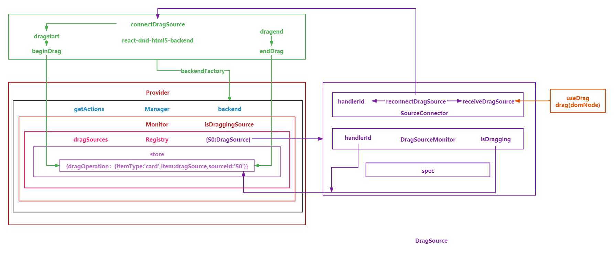

# 实现 React-DnD

## 1.拖拽应用场景

拖拽的业务很常见，比如拖拽菜单 、拖拽卡片和低代码平台等

## 2.React DnD

[react-dnd](https://react-dnd.github.io/react-dnd/about)是 React 和 Redux 核心作者 Dan 创造的一组 React 实用程序，可帮助您构建复杂的拖放界面

## 3.核心

### 3.1 API

HTML 拖放（Drag and Drop）接口使应用程序能够在浏览器中使用拖放功能。例如，用户可使用鼠标选择可拖拽（draggable）元素，将元素拖拽到可放置（droppable）元素，并释放鼠标按钮以放置这些元素。拖拽操作期间，会有一个可拖拽元素的半透明快照跟随着鼠标指针。

| 事件      | 触发时刻                                                |
| --------- | ------------------------------------------------------- |
| dragstart | 当用户开始拖拽一个元素时触发                            |
| dragover  | 当元素被拖到一个可释放目标上时触发(每 100 毫秒触发一次) |
| dragend   | 当拖拽操作结束时触发                                    |

### 3.2 getBoundingClientRect

[getBoundingClientRect](https://developer.mozilla.org/zh-CN/docs/Web/API/Element/getBoundingClientRect)方法返回元素的大小及其相对于视口的位置

### 3.3 clientX/Y

event.clientX 鼠标相对于浏览器左上角 x 轴的坐标； 不随滚动条滚动而改变
event.clientY 鼠标相对于浏览器左上角 y 轴的坐标； 不随滚动条滚动而改变

### 3.4 图解

### 3.5 概念

#### 3.backend

- 绑定事件派发动作

#### 3. DragDropManager(管理器)和 Registry(注册器)

- 管理整个拖拽应用
- 包含仓库和全局 monitor
- 全局 monitor 里包含 registry(注册器)
- 注册器里包含了 handlerId 和对应的 DragSource 或 DropTarget 的对应关系
- 每一个项目都会有一个唯一的 handlerId

#### 4. Items and Types(项目和类型)

- 与 Redux 一样，React DnD 使用数据而不是视图作为来源
- 当您在屏幕上拖动某物时，我们并不是说正在拖动组件或 DOM 节点。 相反，我们说某种类型的项目正在被拖动
- 一个项目是一个简单的 JavaScript 对象，描述被拖动的内容。
- 类型是一个字符串(或 Symbol)，它唯一地标识了应用程序中的项目。
- 类型很有用，因为随着您的应用程序的增长，您可能希望使更多内容可拖动，但您不一定希望所有现有的放置目标突然开始对新项目做出反应。 这些类型允许您指定兼容的拖放源和放置目标

#### 5. Monitors(监听器)

- 收集状态暴露给组件，让组件获取状态。
- 拖放本质上是有状态的。 要么正在进行拖动操作，要么不在。 要么有当前类型和当前项目，要么没有。 这种状态必须存在于某个地方
- React DnD 通过监视器封装内部存储状态,并将此状态公开给您的组件
- 监视器允许您更新组件的属性以响应拖放状态的变化
- 对于需要跟踪拖放状态的每个组件，您可以定义一个收集函数，从监视器获取它的相关属性
- React DnD 然后负责及时调用您的收集函数并将其返回值合并到组件的属性对象中

  ##### 5.1 DragSourceMonitor(拖动源监听器)

  - DragSourceMonitor 是传递给基于钩子或基于装饰器的拖动源的收集函数的对象
  - 它的方法可让您获取有关特定拖动源的拖动状态的信息
  - 绑定到该监视器的特定拖动源在下面称为监视器的所有者
    方法:
    1. isDragging(): 如果拖动操作正在进行中，并且所有者发起拖动，则返回 true
    2. getItemType(): 返回标识当前拖动项目类型的字符串或 Symbol
    3. getItem(): 返回一个表示当前拖动项目的普通对象。 每个拖动源都必须通过从其 beginDrag() 方法返回一个对象来指定它
    4. getClientOffset(): 在拖动操作正在进行时，返回最后记录的 { x, y } 鼠标的客户端偏移量

  ##### 5.2 DropTargetMonitor(放置目标监听器)

  - DropTargetMonitor 是传递给基于钩子或基于装饰器的收集函数的对象
  - 它的方法可让您获取有关特定放置目标的拖动状态的信息
  - 绑定到该监视器的特定放置目标在下面称为监视器的所有者
    方法:

    1. getItemType(): 返回标识当前拖动项目类型的字符串或 Symbol
    2. getItem(): 返回一个表示当前拖动项目的普通对象。 每个拖动源都必须通过从其 beginDrag() 方法返回一个对象来指定它
    3. getClientOffset(): 在拖动操作正在进行时，返回最后记录的 { x, y } 鼠标的客户端偏移量

#### 6 Connectors(连接器)

- 如果后端处理 DOM 事件，但是组件使用 React 来描述 DOM，后端如何知道要监听哪些 DOM 节点？
- 连接器允许您将预定义角色之一（拖动源或放置目标）分配给渲染函数中的 DOM 节点
- 事实上，连接器作为第一个参数传递给我们上面描述的收集函数
- 在组件的渲染方法中，我们可以访问从监视器获得的数据和从连接器获得的函数
  ##### 6.1 DragSourceConnector(拖动源连接器)
  1. DragSourceConnector 是传递给 DragSource 的收集函数的对象
  2. 它提供了将 React 组件绑定到 Drag Source 角色的能力

#### 7 useDrag

- useDrag hook 提供了一种将组件作为拖动源连接到 DnD 系统的方法
- 通过将规范传入 useDrag，您可以声明性地描述正在生成的可拖动的类型、表示拖动源的项目对象、要收集的属性等
- useDrag hooks 返回几个关键项：收集的属性，以及可能附加到拖动源的 refs 参数
  1. spec 规范对象或创建规范对象的函数
  2. type: 必需的。 这必须是字符串或 Symbol。 只有为相同类型注册的放置目标才会对此项目做出反应
  3. item: 必需的 (对象或者函数) 当这是一个对象时，它是一个描述被拖动数据的普通 JavaScript 对象。 这是拖放目标唯一可用的有关拖动源的信息。当这是一个函数时，它在拖动操作开始时被触发，并返回一个表示拖动操作的对象
  4. collect: 可选的。 收集功能。 它应该返回一个普通的属性对象，以返回以注入到您的组件属性中。 它接收两个参数，monitor 和 props 返回值数组
     - Collected Props: 包含从 collect 函数收集的属性的对象。 如果没有定义 collect 函数，则返回一个空对象
     - DragSource Ref: 拖动源的连接器功能。 这必须附加到 DOM 的可拖动部分

#### 8 useDrop

- useDrop hook 为您提供了一种将组件连接到 DnD 系统作为放置目标的方法
- 通过将规范传入 useDrop hook，您可以指定放置目标将接受哪些类型的数据项，要收集哪些属性，等等
- 此函数返回一个要附加到 Drop Target 节点的 ref 和收集到的属性参数
  1. spec 规范对象或创建规范对象的函数
  2. accept 必填项 一个字符串或一个 Symbol,这个放置目标只会对指定类型的拖拽源产生的项目做出反应
  3. collect: 可选的。收集功能。 它应该返回一个普通的属性对象，以返回以注入到您的组件属性中。 它接收两个参数，monitor 和 props
  4. hover(item, monitor): 可选的。 当在组件发生 hover 事件时调用返回值 Collected Props: 包含从 collect 函数收集的属性的对象。 如果没有定义 collect function，则返回一个空对象,DropTarget Ref: 放置目标的连接器函数。 这必须附加到 DOM 的放置目标部分
